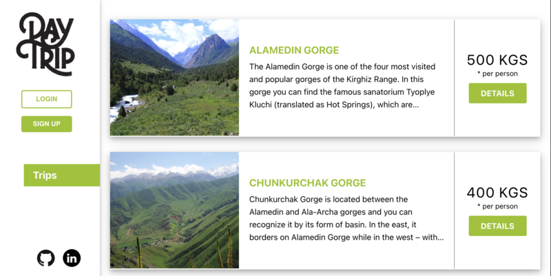
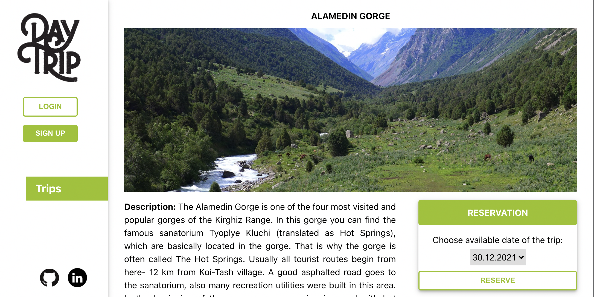
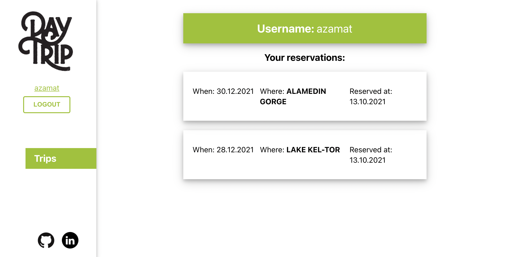

# REACT & REDUX COCKTAILS APP

> Trips reservation app using React, Redux and [Trips Reservation API](https://github.com/bettercallazamat/rails-trips-api/);

## Watch the Live Version

[Live Demo](https://azamats-trips.herokuapp.com/)








### Built with
- JavaScript ES6
- NodeJS
- React
- React-Redux
- react-dom
- react-router-dom
- Axios
- Enzyme
- Webpack
- Buildpack
- Heroku
- Jest

### Features
- Viewing the list of trips
- Viewing a trip's details
- Viewing a user's details(info, reservations made)
- Making reservation for a trip
- Login / Logout / Signup
- Modal messages of success/failure

## Getting Started

In order to run locally this project type the following commands over the terminal in Linux or Mac or the Windows cmd console:

```s
$ git clone git@github.com:bettercallazamat/react-trips.git
$ cd react-trips
$ npm install
$ npm start

```

Open `http://localhost:3000` to view running project in the browser.

## Author

👤 **Azamat Nuriddinov**

- Github: [@bettercallazamat](https://github.com/bettercallazamat)
- Twitter: [@azamat_nuriddin](https://twitter.com/azamat_nuriddin)
- Linkedin: [Azamat Nuriddinov](https://www.linkedin.com/in/azamat-nuriddinov/)

## 🤝 Contributing

Contributions, issues, and feature requests are welcome!

Feel free to check the [issues page](https://github.com/bettercallazamat/react-trips/issues).

## Show your support

Give a ⭐️ if you like this project!

## 📝 License

This project is [MIT](https://opensource.org/licenses/MIT) licensed.